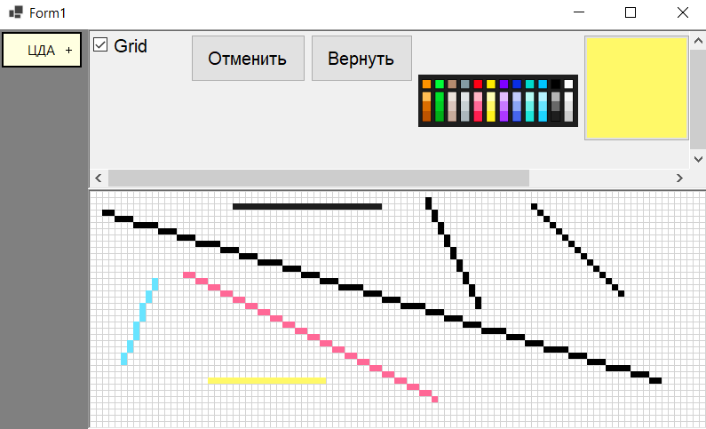
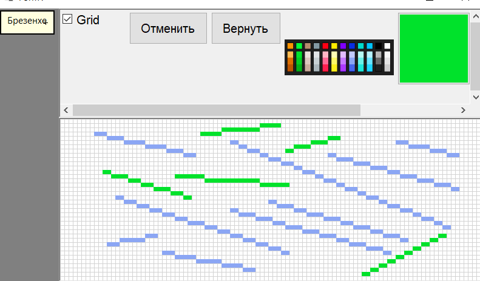
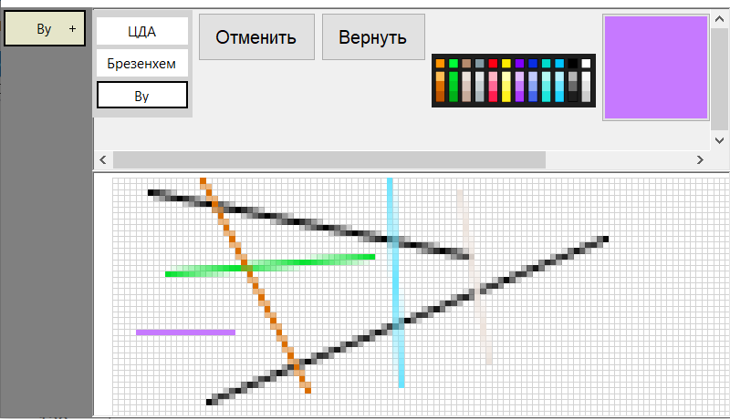

# DrawingEditor

## 🎨 Инструменты для Создания Линий

В редакторе реализованы следующие алгоритмы для рисования линий:

### 🖋️ Цифровой Дифференциальный Анализатор (ЦДА)

Простой и понятный алгоритм, который демонстрирует основы создания линий.

### ✒️ Алгоритм Брезенхема

Эффективный и широко используемый алгоритм, оптимизированный для целочисленной арифметики.

### 🖌️ Алгоритм Ву

Алгоритм сглаживания линий, создающий более эстетичный результат за счет использования пикселей с разным уровнем прозрачности.

