# DrawingEditor

## 🎨 Инструменты для Создания Линий

В редакторе реализованы следующие алгоритмы для рисования линий:

### 🖋️ Цифровой Дифференциальный Анализатор (ЦДА)

Простой и понятный алгоритм, который демонстрирует основы создания линий.

### ✒️ Алгоритм Брезенхема

Эффективный и широко используемый алгоритм, оптимизированный для целочисленной арифметики.

### 🖌️ Алгоритм Ву

Алгоритм сглаживания линий, создающий более эстетичный результат за счет использования пикселей с разным уровнем прозрачности.

## 🎨 Инструменты для Создания Кривых второго порядка 

### Рисование окружностей
Для рисования окружностей используется алгоритм Брезенхема

### Рисование элипсов
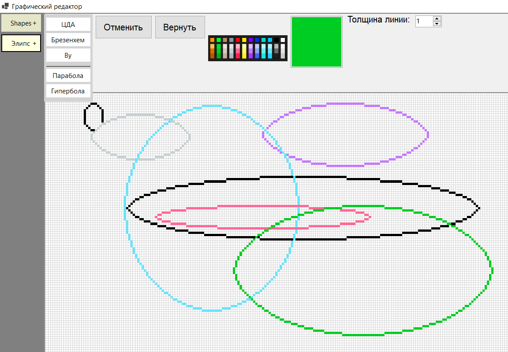

### Рисование парабол
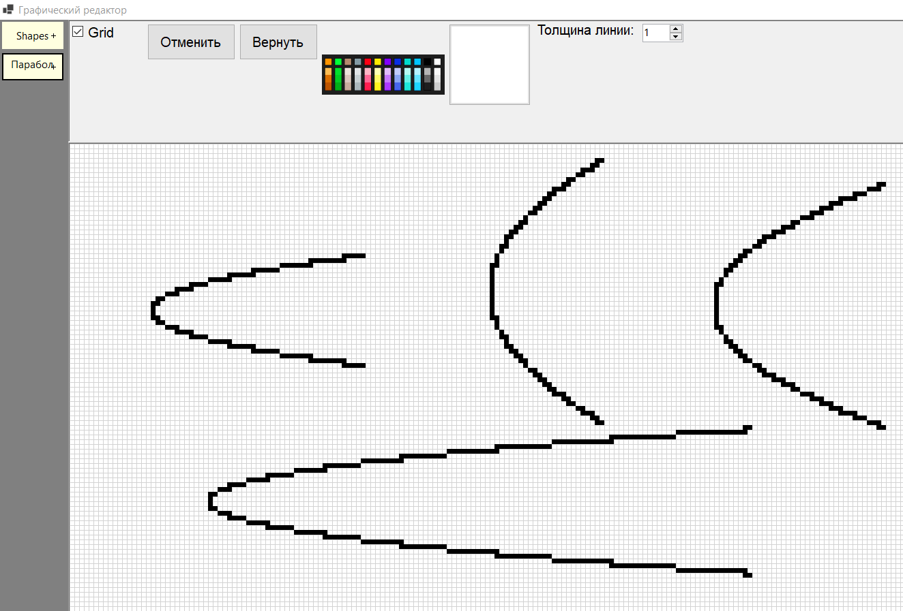

### Рисование гипербол
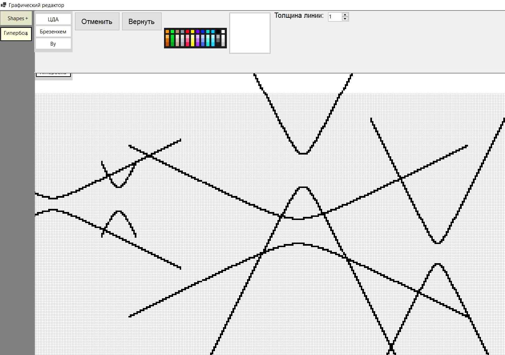

## 🎨 Инструменты для Создания Кривых второго порядка 

### Метод интерполяции Эрмита
Примеры построения кривых:
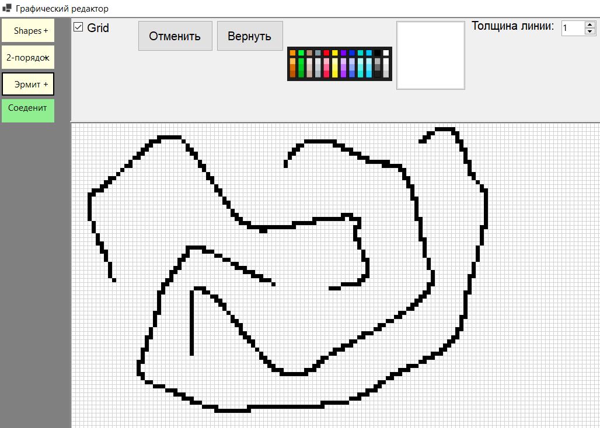

### Пошаговая демонстрация соединения двух кривых
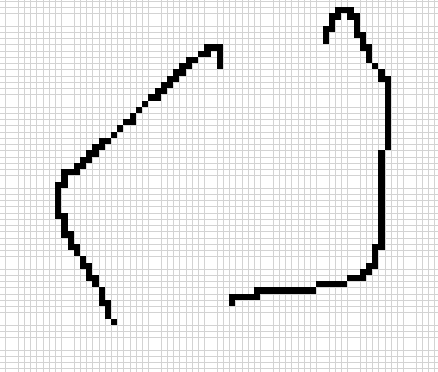
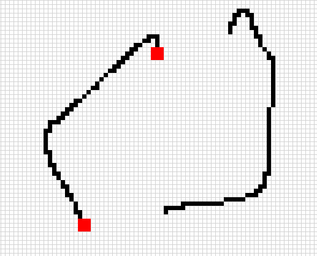
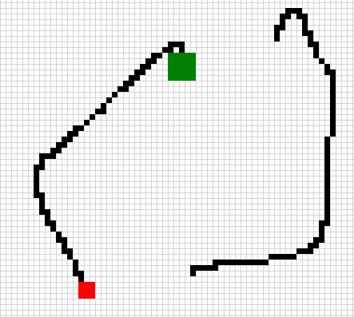
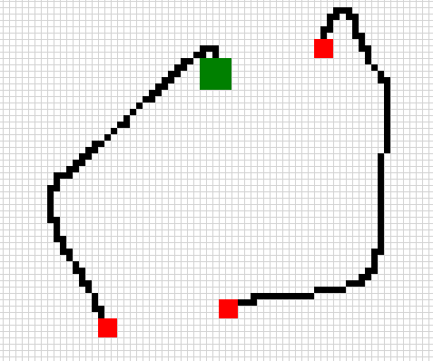
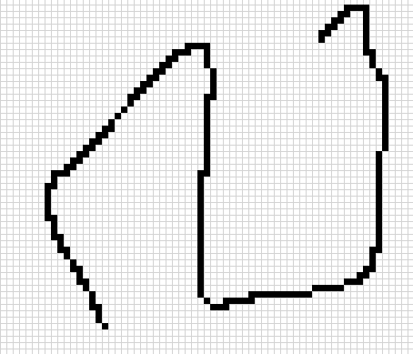

### Метод Безбе
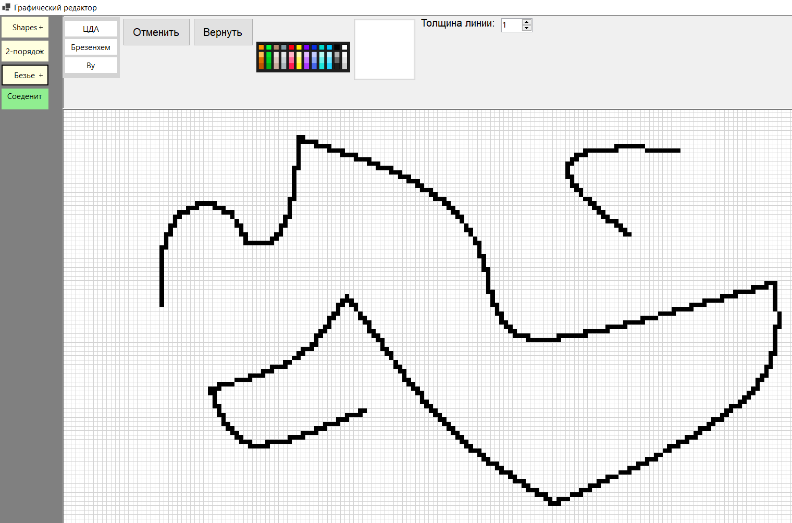

### B-Сплайн
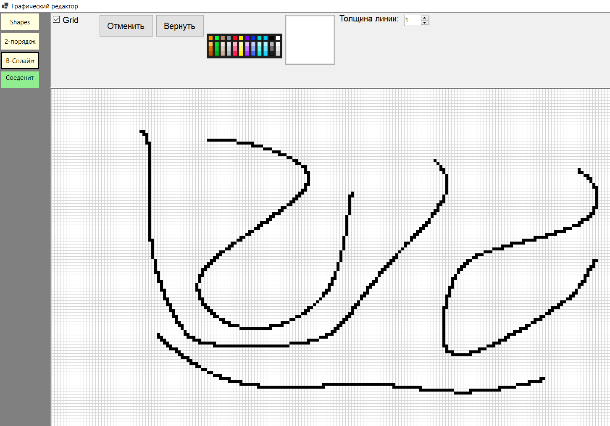

